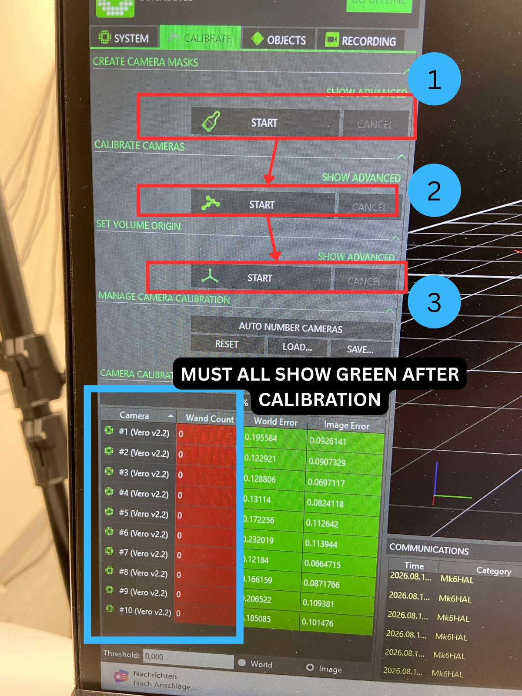
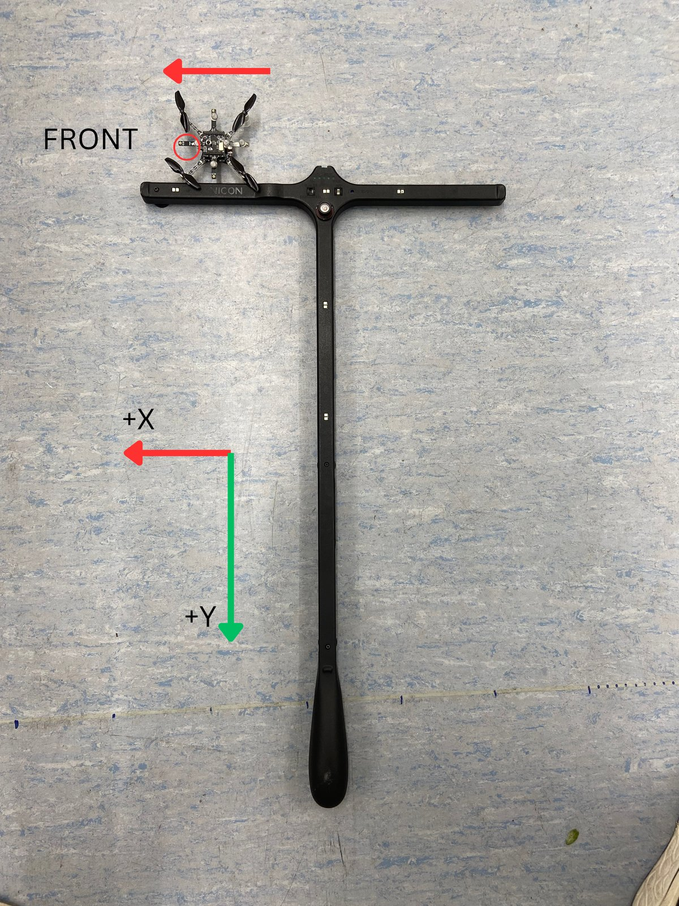
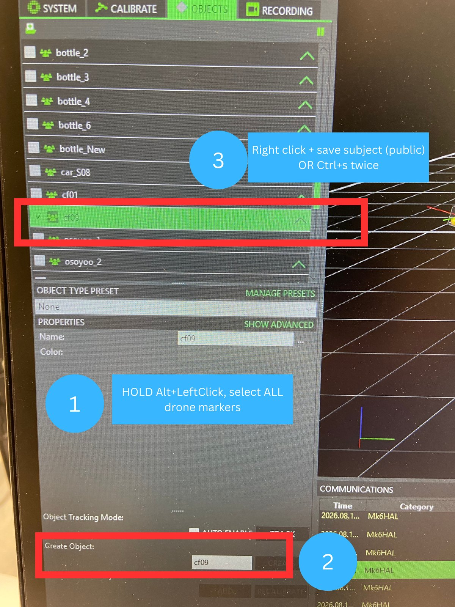
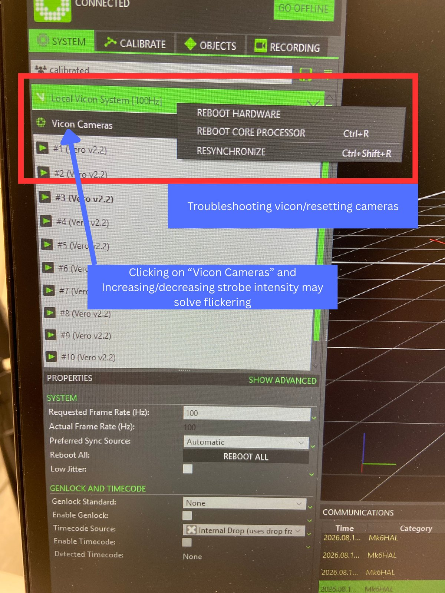
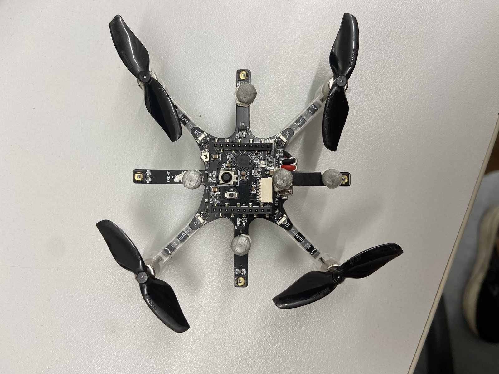

# Full Drone Setup and Launch Procedures

## Vicon setup

How to setup the Z708 Vicon for this project.

1. Plug in the vicon power cable
2. Log into the computer (pwd: fish-tank) and open Vicon Tracker 3.10 (green icon)
3. Calibrate the vicon
    - Navigate to the **Calibration** tab
    - Ensure arena is clear of obstacles
    - Hit **Start** under **Create Camera Masks**. Wait two seconds, then hit stop. The vicon will create a mask over the points it detects in the empty arena, thereby filtering out initial noise.
    - Turn the monitor towards the inside of the motion capture arena so you can see the calibration status as you wave the want. Grab the vicon calibration wand and flick the switch near the top-center to turn it on. 
    - Click **Start Calibration**, and wave the wand around. Ideally, wave the wand in all the places that the drone is expected to fly, otherwise the vicon will have to extrapolate it's calibration to find the drone's position. Keep waving the wand until all the cameras physically show a green light, or the cameras tab on the computer is fully green. As you're calibrating, you should see that each camera window on the ocmputer has a coloured sticker on the bottom right of the panel. As it gets more calibrated, it transitions from red-->green, and then disappears once fully calibrated.
        - If the cameras don't pick up the wand, try turning the wand off and on again. Sometimes the wand's light intensity can decay over time.
    - Click **Start** under **Set Origin**, then place the wand (turned on) where you want your origin to be. Note that the long bar/handle of the wand represents the **Positive Y-AXIS** and the short horizontal bar represents the **X AXIS**. If holding the wand such vertically that it looks like a (T), the **Positive X-AXIS** points to the **Left** of the horizontal bar T.  
    - Once the wand is in place, click **Stop**
    - **Keep the wand on the ground, but turn the lights off**
    - Navigate to the *Views* button which is at the top-left of the inner window that currently shows the camera calibration
    - Click **3D Perspective View** to make sure your origin was set correctly and the cameras are not inside the ground
    
    See images below for help: 
    

4. Create a new subject
    - Place the drone and its markers inside the vicon arena. All points should be visible. If not, head to the cameras tab, click on the highest level **Vicon Camera System** button, and look for the **Strobe Intensity** parameter. Raise or lower it until all points are visible and not flickering.
        - **IMPORTANT**: Ensure that the **Drone's X-axis aligns with the Vicon's X-axis**! If not, the crazyflie will drift mid-air and hit a wall because pitch and roll will be offset because the axes are not aligned.
        - A good practice is to push the drone's body parallel against the top of the vicon wand. Ensure that the drone's *front* marker points towards the left side of the (T) shaped wand.

    

    - Locate the **Subjects Section**
    - **Hold ALT + LEFT CLICK**, and **drag the mouse** to capture all subject points
    - On the bottom left tab, enter the subject name as **cfXX**, where XX is the crazyflie drone number. The vicon will automatically create a topic called */vicon/cfXX/cfXX*, which is what the code expects.
    - Right click on the new subject in the subjects pane, hit save object, and if prompted, hit "shared". 

    See images below for help:
    

## Activate Vicon Receiver Script

1. Run ```colcon build --symlink-install``` to build the workspace, and ```. install/setup.bash``` to source your terminal. 
2. From your root directory, run ```ros2 launch vicon_receiver client.launch.py```
3. If successful and the subject was already created, it should say something like *Creating a topic for subject on /vicon/cfXX/cfXX*
4. Run ```ros2 topic echo /vicon/cfXX/cfXX``` to verify that Vicon data is coming through. If frames drop or the receiver stops working, simply terminate it with *CTRL+C* and restart the receiver

Troubleshooting help can be found below:


## (INFO) How Vicon Data is filtered

`vicon_bridge.py` drops frames that would otherwise poison the EKF:

| Rejected | Why |
|---|---|
| NaN quaternion | garbage attitude OR drone flipped over |
| Non-unit quaternion (>0.1 off) | invalid rotation |
| Translation exactly `(0,0,0)` | Vicon's "lost the object" output; forwarding it teleports the estimator to the origin |
| Bit-identical repeat of previous frame | Tracker re-serves the last pose when tracking is lost; real tracking always has sub-mm noise |

Short gaps aren't a problem, since the onboard Kalman filter coasts through
them. A staleness watchdog warns after 0.25 s.


## Pre-Flight Checklist

- [ ] Battery **fully charged** (4.2 V, not 3.7 V)
- [ ] Drone reachable at its configured URI (if not, CrazyRadio will not connect and an error message will be printed in the launch logs)
- [ ] Vicon Tracker running, subject tracked, no occlusion at the takeoff spot
- [ ] Propellers are intact. Spin each propeller and make sure it spins straight, and you don't see two overlapping blurring areas (that means it's bent or the motor shaft is bent, and needs to be replaced). Ensure motors do not shake or vibrate when spinning propellors.
- [ ] drone sitting level on the floor
- [ ] Workspace built and sourced
- [ ] Kernel cache regenerated **if** `n_sub` or `v` changed since the last flight (see below)
- [ ] Everyone in the room knows where the ESTOP is (it's in the GUI)
- [ ] Drone has 5 ASYMMETRIC MARKERS (see below)



## Editing Parameters before Flight

Everything worth changing lives in three YAML files under
`src/crazyswarm_bringup/config/`:

```
controller_params.yaml    # speeds, takeoff, landing, GoTo
ran_params.yaml           # attractor model gains, timing, RViz
launch_args.yaml          # which drones, takeoff height, record/rviz on-off
```

Edit a value, save, and relaunch. **No rebuild is needed** — `colcon build
--symlink-install` symlinks the config directory, so the launch files read your
source file directly. Every parameter has a comment above it saying what it does.

The ones you are most likely to touch before a flight:

| Parameter | File | What it does |
|---|---|---|
| `max_speed` | `controller_params.yaml` | How fast the drone flies toward its target (m/s) |
| `land_min_height` | `controller_params.yaml` | Below this height, Ctrl+C cuts the motors instead of landing |
| `collision_avoidance` | `ran_params.yaml` | Fly backwards if another drone gets within 0.3 m — turn this on if your targets are real drones |
| `startup_delay` | `ran_params.yaml` | How long the network waits before starting (this is most of the ~15 s wait before flight) |
| `u`, `sigma`, `kappa` | `ran_params.yaml` | The attractor model's gains |
| `drone_names`, `launch_height`, `record` | `launch_args.yaml` | Which drones fly, how high, whether a bag is recorded |

One warning before you start: changing **`n_sub`** or **`v`** means you must
regenerate the kernel cache, or the RAN server refuses to start.

Full details, including kernel cache generation, are in
[`parameter-tuning.md`](parameter-tuning.md).

## Regenerating the Kernel Cache

The attractor network needs a **connection matrix**, which is just a big table
saying how strongly every node on the sphere talks to every other node. Building
it means computing the geodesic distance between every possible *pair* of nodes,
which is slow, so it gets built once ahead of time and cached to
*src/spherical_ran/spherical_ran/kernel_cache.npz*. The server loads that file on
startup instead of doing the work every launch.

**You only need to regenerate it if you changed `n_sub` or `v`** in
*ran_params.yaml*. Those are the only two parameters the kernel is built from.
Everything else in that file (`u`, `sigma`, `kappa`, `beta`, `dt`,
`bump_threshold`, etc.) is read live at startup, so just edit and relaunch.

**To regenerate**:
1. Edit `n_sub` and/or `v` in *src/crazyswarm_bringup/config/ran_params.yaml*
2. **From `~/biodrone`**, run ```python3 src/spherical_ran/spherical_ran/generate_kernel_cache.py```
3. It should print something like:
```
Read from .../config/ran_params.yaml: n_sub=3, v=0.3
Generating connection matrix for 642 nodes (n_sub=3)...
Saved kernel cache to src/spherical_ran/spherical_ran/kernel_cache.npz
```
4. Check that the `n_sub` and `v` it echoes back are the values you just typed in
   the yaml. The script reads them out of *ran_params.yaml* itself, i.e. the same
   file the server reads, so the two can't drift apart. There is deliberately no
   way to pass them on the command line.
5. Relaunch. **No rebuild is needed** — the *.npz* is read from the source tree at
   runtime, same as the config files.

**IMPORTANT**: run the script from `~/biodrone`, and launch from there too. The
`kernel_cache` path in *ran_params.yaml* is **relative**, so it resolves against
whatever directory you happen to be sitting in. Run it from somewhere else and
you'll write the cache to the wrong place and the server won't find it.

If you forget to regenerate, the RAN server **refuses to start** and prints
*kernel cache unusable (cached kernel parameters do not match current
parameters...)*. This is on purpose — running the model on a kernel built for a
different mesh gives quietly wrong headings instead of an obvious failure. Note
that only the RAN server dies, so the rest of the stack comes up fine and the
drone will take off and then just sit there hovering with no heading to follow.
If that happens to you, this is the first thing to check.

**Cost**. `n_sub` is the icosphere subdivision level, and the node count is
`10 * 4^n_sub + 2`. The generator is O(N²), so it gets expensive quickly:

| `n_sub` | Nodes | Time to generate |
|---|---|---|
| 2 | 162 | under 1 s |
| 3 (default) | 642 | ~9 s |
| 4 | 2562 | ~2 min 20 s |
| 5 | 10242 | ~35 min (don't) |

Raising `n_sub` also costs you on every tick of the live model, not just here, so
it's not a free accuracy knob.

If you just want to try a value out without clobbering the cache you know works,
send it somewhere else with ```--out```:

```
python3 src/spherical_ran/spherical_ran/generate_kernel_cache.py --out /tmp/trial.npz
```

The script will remind you that the server is still loading the old path, and
won't pick your trial up until you point `kernel_cache` at it.

## Launching the Drone

**Note on Stopping the Launch**:
| Action | Effect |
|---|---|
| **First Ctrl+C** | Lands if airborne above `LAND_MIN_HEIGHT` (0.5 m); ESTOPs if lower |
| **Second Ctrl+C** | Emergency stop — motors cut, drone **drops** |
| **GUI ESTOP** | Same as second Ctrl+C, always responsive |

`sigterm_timeout` is set to 7 s so that `crazyflie_server` and `vicon_bridge`
outlive the 5 s landing (`real_drone.launch.py:225`). `vicon_bridge` also
deliberately ignores the first SIGINT so that mocap keeps flowing during the
descent — without that, the drone lands blind on dead reckoning.

The land duration and height thresholds are `LAND_DURATION`, `LAND_HEIGHT`, and
`LAND_MIN_HEIGHT` at `controller_server.py:27`.

**Launching the drone**:
1. Ensure workspace is built and sourced
2. Power cycle the drone to re-arm the drone. If land/ESTOP is called in the previous flight, the drone won't unlock it's motors until it has been power cycled.
2. Run ``ros2 launch crazyswarm_bringup real_drone.launch.py teleop:=true auto_launch:=false ran_enabled:=false``. 
    - A teleop window, GUI menu, and RViz will open up. 
    - The drone will only be moveable by teleop, i.e. the spherical attractor netowkr will not publish, and the drone will not auto-launch
    - Look at the GUI menu, and ensure **Battery Voltage** is sufficiently higher than *3.7 V*, position error is not jumping too much, and the vicon is not dropping frames too much
    - Note that the drone's onboard estimator only returns its position at **5 Hz**, so the position error graph may jump back and forth a bit, but this is normal
3. Get ready to hit the **ESTOP**. When ready, in the GUI, hit **Takeoff**, and pray that the drone launches up and stays up. 
    - Ensure that the motors are somewhat balanced (look at M1-M4, M1-M3 split, M2-M4 split, and overall split). A small split is fine, a large split means new motor and/or propellor (weak motor).
4. Move it around with ros2's teleop terminal to confirm it can fly properly
5. When you are confident that the drone can fly properly, run the full launch script ```ros2 launch crazyswarm_bringup real_drone.launch.py```
    - The drone should auto launch in the air, wait around 15 seconds for the spherical attractor network to generate, and then fly towards the target by following the heading vector that was published by the SAN. 
    - It is recommended to use invisible movable markers as targets in rviz rather than real drones. If using real drones, enable the **Collision Avoidance** parameter in the yaml file, which flies the drone backwards if it gets within 0.3m of another drone.


## What Got Fixed (2026-08-20)

Short summary of the bugs closed today, what actually caused them, and what
changed.

**GoTo and Land dropped the drone out of the air.**
- *Symptom*: hit **Go To**, drone flies nowhere, levels off, then falls after
  about a second. **Land** did the same thing.
- *Cause*: the firmware picks who is flying the drone using a priority number.
  Our 50 Hz `cmd_velocity_world` stream is priority **2**; the onboard
  high-level commander (which is what actually executes GoTo and Land) is
  priority **1**. Every setpoint we streamed left the firmware latched at 2,
  and **nothing ever unlatches it**. So the GoTo was planned correctly and then
  every setpoint it produced was thrown away for being too low-priority. The
  drone kept holding the last velocity we sent, and the onboard safety watchdog
  timed that stale command out — level off at 0.5 s, cut motors at 2 s.
- *Fix*: call `<drone>/notify_setpoints_stop` before every GoTo and Land, which
  tells the firmware to drop the priority back down. It was already available
  and simply never called. Order matters: the setpoint stream is stopped
  **first**, because one more streamed setpoint re-latches it.

**The SAN stole the GoTo partway through (sim).**
- *Symptom*: GoTo starts, then the drone veers off to the attractor target
  instead.
- *Cause*: two things. The GoTo ramp was computed but never actually sent — the
  "where should I be" field was overwritten with the drone's *measured*
  position every tick, so the sim always thought it was exactly where it should
  be. And separately, the heading callback overwrote the commanded velocity
  unconditionally, so the first SAN heading to arrive took the wheel.
- *Fix*: the ramp is now actually commanded, and SAN headings are ignored while
  a GoTo or Land owns the drone. The SAN takes back over by itself once the
  move finishes.

**Turning the SAN off didn't stop the drone.**
- *Symptom*: hit the GUI toggle, the network goes quiet, drone keeps flying
  anyway.
- *Cause*: the controller stores the last heading it was given and **nothing
  ever clears it**. Silence just means it keeps flying the last direction
  forever. (Worth knowing: this also happens whenever the bump dissolves — the
  drone coasts on a stale heading.)
- *Fix*: the controller now watches `<drone>/ran_enabled_status` and drops the
  held heading when the SAN is switched off. Headings already in flight are
  ignored too, otherwise they re-arm the command a tick later.

**`teleop` secretly did three things.**
- *Cause*: `teleop:=true` opened the keyboard window, forced `auto_launch` off,
  AND silenced the SAN — all from one flag, which is why keyboard and model
  were mutually exclusive.
- *Fix*: split into `teleop` (window only), `ran_enabled` (SAN publish), and
  `auto_launch` (independent again). Any combination is now legal. Keyboard +
  SAN together is genuinely useful: a keypress owns the drone for
  `teleop_timeout` seconds, then the model resumes, so the keyboard is an
  override rather than a competitor.

**Ctrl+C aimed the landing underground.**
- *Cause*: the shutdown path still passed `-pos[Z]` as the land height. That
  value is an *absolute* altitude, so at 1.2 m it commanded "descend to
  −1.2 m".
- *Fix*: it passes the floor (0.0) now, same as the GUI Land button already did.
- *Still open*: `land_min_height` is 0.5 and `launch_height` is also 0.5, so at
  normal hover height Ctrl+C is a coin flip between landing and ESTOP. Raise one
  or lower the other when you get a chance.

## Gotchas

- **`send_orientation` depends on the firmware.** `real_drone.launch.py:96`
  sets it to `True`, which requires firmware 2026.04 or newer with the fixed
  external-attitude update. On older firmware the EKF diverges and the drone
  runs away, so verify the firmware version before trusting this.
- **`Land.height` is an absolute height, not a descent distance.** It goes
  straight through to cflib's `land(absolute_height_m, ...)`, so a negative
  value aims the planner below the floor.
- **A land command spins the motors** even when the drone is on the ground,
  because it activates the high-level commander. That's exactly what the
  `LAND_MIN_HEIGHT` guard is there to prevent.
- Bags are written to `bags/flight_<timestamp>/`, which is gitignored.


**Debugging**
See [`troubleshooting.md`](troubleshooting.md) for debugging tips, and [`analysis.md`](analysis.md) for instructions on analyzing flight data.

- decouple teleop from SAN
- investiage divergent ekf on crazyflie when no vicon data is received
- need to power cycle on each flight
- Really investingate why vicon tracker 3.1 drops (try nexus)?
- toggle attractor network from gui
- drone ahead of SAN, why?

- Send github repo link